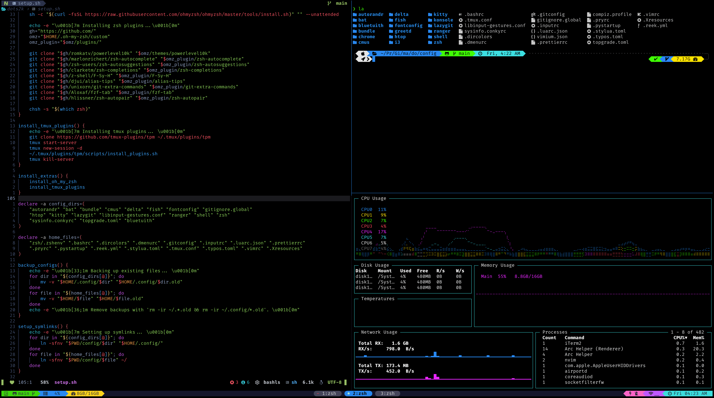

<div align="center">

<h1>dotbuntu — Dotfiles en Ubuntu/WSL/Codespaces</h1>

<br/>
<br/>



</div>

### ¿Qué es dotbuntu?

`dotbuntu` es un script único que instala dependencias y configura tus dotfiles de forma segura y guiada usando `dotbare`. Funciona en Ubuntu/Debian, WSL y GitHub Codespaces.

- Seguro: validaciones de entorno, no corre como root, checks de conexión.
- Claro: mensajes explicativos, resúmenes y confirmaciones.
- Sencillo: indica tu repo de dotfiles y listo.

---

### TL;DR

```bash
git clone https://github.com/25ASAB015/dotbuntu
cd dotbuntu
bash dotbuntu --repo https://github.com/usuario/mis-dotfiles.git
```

Consejo: si `~/.local/bin` no está en tu `PATH`, agrégalo a tu shell (ver más abajo).

### Tabla de contenidos

- [Requisitos](#requisitos)
- [Instalación rápida](#instalación-rápida)
- [Uso básico](#uso-básico)
- [Opciones disponibles](#opciones-disponibles)
- [¿Qué hace exactamente?](#qué-hace-exactamente)
- [Resumenes y reintentos](#resumenes-y-reintentos)
- [Relanzar instalación](#relanzar-instalación)
- [Variables de entorno útiles](#variables-de-entorno-útiles)
- [Ejemplos prácticos](#ejemplos-prácticos)
- [Solución de problemas](#solución-de-problemas)
- [FAQ](#faq)
- [Desinstalación](#desinstalación)
- [Créditos](#créditos)

### Requisitos

- Ubuntu/Debian (o WSL/Codespaces con base Ubuntu) con `apt`.
- Acceso a `sudo` para instalar paquetes.
- Conexión a internet.

### Instalación rápida

```bash
git clone https://github.com/25ASAB015/dotbuntu
cd dotbuntu
bash dotbuntu
```

Sugerido: ejecuta desde tu `HOME` para evitar confusión de rutas:

```bash
cd ~ && bash /ruta/al/repo/dotbuntu/dotbuntu
```

### Uso básico

```bash
# Ejecutar con el repositorio por defecto del script
bash dotbuntu

# O indicando tu repositorio (HTTPS o SSH)
bash dotbuntu --repo https://github.com/usuario/mis-dotfiles.git
bash dotbuntu git@github.com:usuario/mis-dotfiles.git
```

El script instalará lo necesario y configurará `dotbare` apuntando al repo que indiques.

### Opciones disponibles

- `--repo URL`: URL del repo de dotfiles para `dotbare` (equivale a argumento posicional).
- `-h`, `--help`: muestra ayuda y ejemplos.

Notas:
- Si indicas `--repo` y además un argumento posicional, tiene prioridad el último leído.
- Puede solicitar tu contraseña de `sudo` para instalar paquetes.

### ¿Qué hace exactamente?

1. Verifica entorno: Ubuntu/Debian, no root, conexión a internet. Detecta WSL/Codespaces (informativo).
2. Instala dependencias con `apt` si faltan: `git`, `curl`, `ca-certificates`, `tree`, `highlight`, `ruby-full`, `git-delta`.
3. `bat`/`batcat`: crea alias `bat` si solo existe `batcat`.
4. Instala `coderay` (gem) si está disponible `gem`.
5. Muestra un Resumen APT: presentes, instalados, fallidos (con pausa opcional para leer).
6. Reintenta instalar paquetes fallidos si aceptas.
7. Instala `dotbare` (clone a `~/.dotbare`) y añade su plugin/`PATH` a `~/.bashrc`/`~/.zshrc`.
8. Configura `dotbare` en `DOTBARE_DIR` (por defecto `~/.cfg`) y `DOTBARE_TREE` (por defecto `~`).
   - Si SSH al repo falla, intenta automáticamente por HTTPS.
   - Si `~/.cfg` existe y es repo bare, respeta el remoto (no lo cambia sin forzar).
9. Muestra un Resumen final: APT (presentes/instalados/fallidos) y estado de `dotbare` (ruta ↔ remoto).
10. Registra errores en `~/.local/share/dotbuntu/install_errors.log`.

Tiempo estimado: 2-10 minutos (según conexión y paquetes previos).

### Resumenes y reintentos

- Resumen APT (al terminar la fase de paquetes):
  - APT presentes, APT instalados, APT fallidos.
  - Estado de `bat/batcat` y `gem coderay`.
- Reintento interactivo: si hay fallos, puedes reintentar la instalación solo de los fallidos.
- Pausa para leer: se detiene esperando Enter (omite con `NO_PAUSE=1`).

### Relanzar instalación

Si al final aún hay paquetes fallidos, el script:
- Sugerirá instalarlos manualmente con: `sudo apt-get install -y ...`.
- Ofrecerá relanzar la instalación completa. Si aceptas:
  - Elimina `~/.cfg` y `~/.dotbare`.
  - Relanza el script con los mismos argumentos.

En modo no interactivo (sin TTY) no relanza automáticamente; muestra cómo hacerlo manualmente.

### Variables de entorno útiles

- `DOTBARE_DIR`: ruta del repo bare (defecto: `~/.cfg`).
- `DOTBARE_TREE`: working tree de tus dotfiles (defecto: `~`).
- `NO_CLEAR=1`: no limpiar la pantalla entre pasos.
- `NO_PAUSE=1`: no pausar tras el Resumen APT.
- `VERBOSE=1`: mostrar comandos/tiempos con más detalle.
- `DRY_RUN=1`: simular acciones (no modifica tu sistema).
- `TEST_FAIL_APT=1` o `=nombre`: forzar fallo APT (útil para probar reintentos/relanzar).
- `FORCE`: el script soporta forzar ciertas operaciones vía opción CLI (ver más abajo).

Ejemplo:

```bash
NO_CLEAR=1 VERBOSE=1 bash dotbuntu --repo https://github.com/usuario/mis-dotfiles.git
```

### Ejemplos prácticos

```bash
# Repo por defecto
bash dotbuntu

# Elegir un repositorio
bash dotbuntu --repo https://github.com/usuario/mis-dotfiles.git
bash dotbuntu git@github.com:usuario/mis-dotfiles.git

# Probar flujo de fallos y reintentos
TEST_FAIL_APT=1 NO_CLEAR=1 bash dotbuntu

# Forzar manejo de remoto y conflictos (avanzado, ver flags)
bash dotbuntu --repo git@github.com:usuario/mis-dotfiles.git --force
```

### Solución de problemas

- «Este script está pensado para Ubuntu/Debian»: tu sistema no tiene `apt`.
- Sin conexión: revisa red/Proxy; el script intenta HTTPS y ping a 8.8.8.8.
- Fallos APT: usa el reintento o instala manualmente los listados en el Resumen APT.
- SSH al repo falla: el script intenta automáticamente por HTTPS si es GitHub.
- `~/.cfg` existe pero no es repo bare: el script pedirá que ejecutes con `FORCE=1` para respaldar y continuar.

Helpers de dotbare no encontrados:

```text
/home/usuario/.local/bin/dotbare: line 16: .../helper/set_variable.sh: No such file or directory
```

- El instalador crea un wrapper en `~/.local/bin/dotbare` que ejecuta `~/.dotbare/dotbare`, asegurando que los helpers se resuelvan bien.
- Verifica que existe: `head -n1 ~/.local/bin/dotbare` debería mostrar `#!/usr/bin/env bash`.
- Asegura que `~/.local/bin` está en tu `PATH` (ver apartado siguiente).

Incluir `~/.local/bin` en tu PATH (si hace falta):

```bash
echo 'export PATH="$HOME/.local/bin:$PATH"' >> ~/.bashrc
source ~/.bashrc
```

Logs de errores:

```bash
cat "$HOME/.local/share/dotbuntu/install_errors.log"
```

### FAQ

**¿Dónde se guardan mis dotfiles?**  
En `~/.cfg` (repo bare gestionado por `dotbare`). Tu `$HOME` es el working tree.

**¿Puedo cambiar el repositorio de dotfiles más tarde?**  
Sí. Ejecuta de nuevo con otra URL. Si hay un remoto distinto, el script te lo indicará (puedes usar `FORCE=1`).

**¿Necesito SSH?**  
No. Puedes usar HTTPS. Con SSH necesitas llaves configuradas.

**¿Debo ejecutar como root?**  
No. El script lo impide. Usa tu usuario normal con `sudo` cuando se solicite.

### Desinstalación

Para revertir:

```bash
# Quitar dotbare instalado por script
rm -rf "$HOME/.dotbare"

# Quitar repo bare de dotfiles (respalda antes si lo necesitas)
mv "$HOME/.cfg" "$HOME/.cfg.backup"

# (Opcional) Limpia entradas añadidas en ~/.bashrc o ~/.zshrc:
# - source ~/.dotbare/dotbare.plugin.bash
# - export PATH="$HOME/.dotbare:$PATH"
# - export PATH="$PATH:$HOME/.local/bin"
```

### Créditos

- Gestión de dotfiles basada en `dotbare`.
- Proyecto bajo GPL-3.0. Diseñado para una experiencia clara en terminal.


